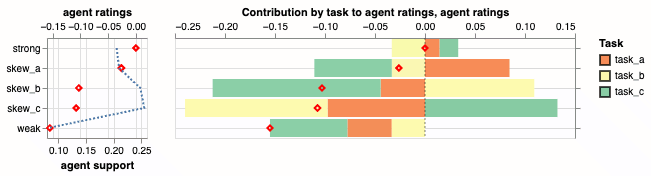

# polarix

[](https://github.com/google-deepmind/polarix/actions/workflows/pytest_and_autopublish.yml)
[](https://badge.fury.io/py/polarix)

## Overview

> The name `polarix` draws from the Polaris star system, a guiding
 star, and ends in 'x' to reflect its ties to the JAX ecosystem.

`polarix` is an accelerated equilibrium solving and evaluation library for
computing **interpretable** ratings at **game-theoretic equilibria**.

The game-theoretic approach dynamically adjusts the relevance of each action
(e.g. an evaluation task, a candidate model, an agent) based on how they
interact with each other. The rating equilibrium that is selected continually
adapts to the capability frontiers of each player based on an overarching
evaluation objective that you define.

### What is `polarix` for?

* **Evaluation:** `polarix` is designed for dynamic evaluation
systems where new candidates and tasks are continually introduced and where one
may wish to know the value of each candidate and each task.
* **Training:** `polarix` can be used to identify frontier
candidates and frontier tasks, making training more robust and efficient.
* **Research:** `polarix` implements accelerated equilibrium solvers for
 n-player general-sum games, which can also serve as baselines for game-theory
 research in equilibrium solving and selection.

## Installation

You can install `polarix` from PyPi:

```bash
pip install -U polarix
```

or from source, with no stability guarantees.

```bash
pip install git+git://github.com/google-deepmind/polarix.git
```

## Quick Start
Here's a simple example of how to use `polarix` to rate agents based on their
 performance on a set of tasks.

```python
import numpy as np
import polarix as plx

agents = np.array(['skew_a', 'skew_b', 'skew_c', 'weak', 'strong'])
tasks = np.array(['task_a', 'task_b', 'task_c'])
scores = np.asarray([
    [6.0, 4.0, 3.0],  # skew_a
    [3.0, 5.0, 2.0],  # skew_b
    [1.0, 3.0, 7.0],  # skew_c
    [3.0, 4.0, 3.0],  # weak
    [5.0, 4.0, 5.0],  # strong
])
scores_stddev = np.full_like(scores, fill_value=0.1)

# 1. Define the evaluation game from an agent-vs-task score matrix.
# From this agent-vs-task score matrix, we construct a 3-player game between a
#  'task' player and two 'agent' players.
#
# Each agent player chooses an agent and is rewarded for outperforming
#  competition on the task selected by the task player. The task player is
#  rewarded by the agent players' score difference, i.e. separating the agents.
#
# The `plx.agent_vs_task` helper function constructs such a 3-player game from
#  an agent-vs-task score matrix. Instances of `plx.Game` can be constructed
#  directly from payoff tensors as well.
game = plx.agent_vs_task_game(
    agents=agents, tasks=tasks, agent_vs_task=scores, normalizer='winrate'
)

# 2. Solve for the max-entropy correlated equilibrium strategy and ratings.
res = plx.solve(game, plx.ce_maxent)

# 3. Analyze agent ratings in terms of comparative strengths and weaknesses.
chart = plx.plot_rating_contribution(
    game,
    joint=res.joint,
    rating_player=1,
    contrib_player=0,
    use_categorical_contrib=True,
)
```

Executing `chart.display()` shows agent ratings, broken down by task.



Each model's total score (red diamond) is the sum of its comparative strengths
(positive bars) and weaknesses (negative bars), all measured relative to an
equilibrium strategy. By definition of our ratings, the maximum possible
rating is zero, achieved by the strong generalist model. The blue dashed line
shows the probability that each agent is played at the equilibrium. Note that
specialist agents all received significant probability mass at the equilibrium,
showing that the top-ranked agent does not dominate competing agents on all
tasks.

## References

If you find this library useful, please consider citing it:

```
@inproceedings{
  liu2025reevaluating,
  title={Re-evaluating Open-ended Evaluation of Large Language Models},
  author={Siqi Liu and Ian Gemp and Luke Marris and Georgios Piliouras and Nicolas Heess and Marc Lanctot},
  booktitle={The Thirteenth International Conference on Learning Representations},
  year={2025},
  url={https://openreview.net/forum?id=kbOAIXKWgx}
}
```

This project also builds on these published works:

*   Balduzzi, David, et al. "Re-evaluating evaluation." *Advances in Neural
    Information Processing Systems 31 (2018).*
*   Gemp, Ian, Luke Marris, and Georgios Piliouras. "Approximating Nash
    Equilibria in Normal-Form Games via Stochastic Optimization." *The Twelfth
    International Conference on Learning Representations.*
*   Marris, Luke, et al. "Multi-agent training beyond zero-sum with correlated
    equilibrium meta-solvers." *International Conference on Machine Learning.
    2021.*
*   Gemp, Ian, et al. "Sample-based Approximation of Nash in Large Many-Player
    Games via Gradient Descent." *Proceedings of the 21st International
    Conference on Autonomous Agents and Multiagent Systems. 2022.*

## Disclaimer

*This is not an officially supported Google product.*
